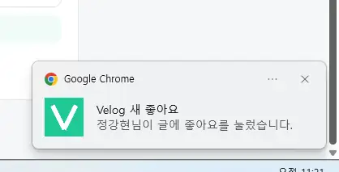
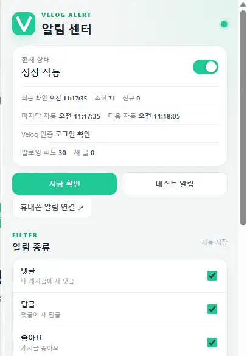
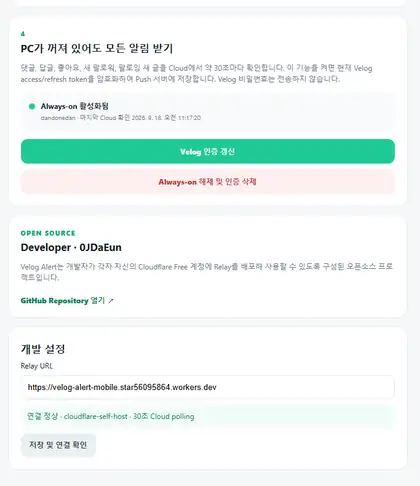
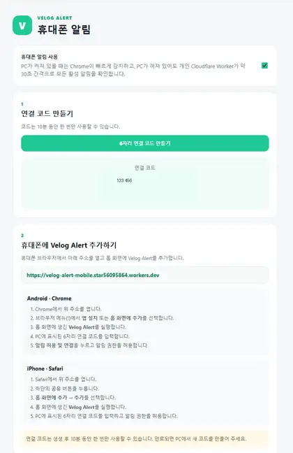

# 🔔 Velog Alert

<p align="center">
  <strong>Velog의 새 활동을 Chrome과 모바일에서 받아보는 Self-hosted Notification Extension</strong>
</p>

<p align="center">
  댓글 · 답글 · 좋아요 · 새 팔로워 · 팔로잉 새 글을 감지하고,<br/>
  PC가 꺼져 있어도 개인 Cloudflare Worker가 약 30초 간격으로 확인해 모바일 PWA로 전달합니다.
</p>

<p align="center">
  
  
  
  
  
</p>

<p align="center">
  Developer · <a href="https://github.com/0JDaEun"><strong>0JDaEun</strong></a>
  &nbsp;·&nbsp;
  <a href="https://github.com/0JDaEun/velog-alert">Repository</a>
</p>

> Velog Alert는 Velog 공식 제품이 아닌 독립적인 오픈소스 프로젝트입니다.  
> Velog 공식 Webhook이 아니라 **약 30초 polling 기반의 준실시간 알림**을 제공합니다.

### 바로가기

[기능](#한눈에-보기) · [동작 방식](#동작-방식) · [설치](#설치-및-사용법) · [보안](#보안과-개인정보) · [무료 운영](#free-first) · [FAQ](#faq)

---

## 빠른 시작

### PC 알림만 사용할 때

```text
Extension ZIP 설치
→ Velog 로그인
→ Popup에서 지금 확인
→ 완료
```

Cloudflare 계정이나 모바일 설정은 필요하지 않습니다.

### 모바일 + PC OFF 알림까지 사용할 때

```text
Extension 설치
→ 자신의 Cloudflare Free backend 배포
→ workers.dev Relay URL 연결
→ 휴대폰 PWA Pairing
→ 테스트 Push
→ Always-on 활성화
```

Cloudflare Plugin/MCP나 ChatGPT Desktop은 설치에 필요하지 않습니다. **Wrangler CLI만 사용합니다.**

---

## 한눈에 보기

<p align="center">
  
</p>

Velog Alert는 **PC에서만 사용하는 Chrome Extension**으로도 동작합니다.  
모바일 알림과 PC OFF Always-on 기능이 필요할 때만 자신의 **Cloudflare Free 계정**에 backend를 배포하면 됩니다.

| 이벤트 | PC 알림 | 모바일 Push | PC OFF |
|---|:---:|:---:|:---:|
| 새 댓글 | ✅ | ✅ | ✅ |
| 새 답글 | ✅ | ✅ | ✅ |
| 좋아요 | ✅ | ✅ | ✅ |
| 새 팔로워 | ✅ | ✅ | ✅ |
| 팔로잉 사용자의 새 글 | ✅ | ✅ | ✅ |

추가로 알림 종류별 ON/OFF, 최근 감지 기록, 테스트 알림, 중복 방지, 최초 설치 baseline, Chrome 재시작 대응을 제공합니다.

---

## 동작 방식

### PC가 켜져 있을 때

```text
Velog
  ↓
Chrome Extension
  ↓ 약 30초
새 활동 감지
  ├─ Chrome Notification
  └─ Mobile Web Push
```

Chrome Extension이 직접 Velog를 확인합니다. 이때 Cloudflare에는 heartbeat를 보내 **불필요한 중복 Cloud polling을 건너뜁니다.**

### PC가 꺼져 있을 때

```text
Velog
  ↓
User's Cloudflare Worker
  ↓
Durable Object Alarm
  ↓ 약 30초
새 활동 감지
  ↓
Web Push
  ↓
Android / iPhone PWA
```

PC의 마지막 heartbeat는 약 90초 동안 유효합니다. 따라서 PC를 막 종료한 직후에는 Cloud 전환까지 약간의 시간이 추가될 수 있고, 이후에는 약 30초 polling으로 동작합니다.

---

## 설치 및 사용법

## STEP 1. Chrome Extension 설치

정식 배포 ZIP을 받은 경우:

1. `Velog_Alert_v2.1.0_EXTENSION.zip`을 다운로드합니다.
2. ZIP 압축을 풉니다.
3. Chrome에서 `chrome://extensions`를 엽니다.
4. 우측 상단 **개발자 모드**를 켭니다.
5. **압축해제된 확장 프로그램을 로드합니다**를 누릅니다.
6. 압축을 푼 폴더에서 `manifest.json`이 바로 들어 있는 폴더를 선택합니다.

> ZIP 자체를 Chrome에 넣는 것이 아니라 반드시 먼저 압축을 풀어야 합니다.

<p align="center">
  
</p>

Velog에 로그인한 뒤 Popup에서 **지금 확인**을 한 번 실행하세요.  
최초 확인은 현재 알림을 baseline으로 저장하므로 과거 알림이 한꺼번에 표시되지 않는 것이 정상입니다.

### 기본 확인 주기

v2.1의 기본값은 **30초**입니다.

```text
30초 (기본)
1분
5분
10분
30분
```

30초 모드는 Chrome 120 이상을 사용합니다.

---

## STEP 2. 모바일을 쓸 경우 Cloudflare backend 배포

PC 알림만 필요하면 이 단계는 생략할 수 있습니다.

모바일 Push와 PC OFF Always-on을 사용하려면 **각 사용자가 자신의 Cloudflare Free 계정에 직접 배포**합니다.

### 준비물

- Git
- Node.js 20+
- Cloudflare Free 계정
- Chrome 120+
- Velog 로그인 계정

> Cloudflare Workers Paid 가입이나 결제수단 등록을 요구하지 않는 구성을 기본으로 합니다.

### 배포

```bash
git clone https://github.com/0JDaEun/velog-alert.git
cd velog-alert

# v2.1 정식 merge 전 테스트 중이라면:
# git checkout feat/cloudflare-free-first-v3

cd cloudflare

npm install
npx wrangler login --device --use-keyring
npm run setup
```

`npm run setup`은 다음 과정을 자동으로 수행합니다.

```text
Node.js / Cloudflare 로그인 확인
        ↓
Free-only 구조 검사
        ↓
AUTH_KEY 생성
        ↓
Web Push VAPID key 생성
        ↓
Wrangler dry-run
        ↓
Worker + Durable Objects + PWA 배포
        ↓
임시 Secret 파일 삭제
```

정상적으로 끝나면 Wrangler가 다음과 같은 **본인의 실제 URL**을 출력합니다.

```text
https://velog-alert-mobile.<your-subdomain>.workers.dev
```

> `https://*.workers.dev`는 URL 패턴을 설명하기 위한 표기입니다.  
> Extension에는 반드시 setup 마지막에 출력된 **실제 workers.dev URL**을 입력하세요.

자세한 배포 문서는 [Cloudflare Self-host 설치 가이드](docs/CLOUDFLARE_SELF_HOST.md)를 참고하세요.

---

## STEP 3. Relay URL 연결

Extension Popup에서 **휴대폰 알림 연결**을 열고 아래 순서로 진행합니다.

```text
개발 설정
→ Relay URL
→ 본인의 workers.dev URL 입력
→ 저장 및 연결 확인
```

<p align="center">
  
</p>

정상이라면 다음과 비슷한 상태가 표시됩니다.

```text
연결 정상 · cloudflare-self-host · 30초 Cloud polling
```

Relay URL을 바꾸면 PWA의 origin도 달라지므로 휴대폰은 새 Relay 주소에서 다시 연결해야 합니다.

---

## STEP 4. 휴대폰 Pairing

PC에서 **6자리 연결 코드 만들기**를 누릅니다.

<p align="center">
  
</p>

README의 코드는 예시입니다. 실제로는 Extension에 표시되는 본인의 6자리 코드를 사용하세요.

- 코드는 약 10분 동안 유효합니다.
- 한 번 연결에 성공하면 해당 pairing code는 폐기됩니다.
- 장기 인증정보로 사용하지 않습니다.

### Android

1. Android Chrome에서 자신의 `workers.dev` URL을 엽니다.
2. 메뉴에서 **앱 설치** 또는 **홈 화면에 추가**를 선택합니다.
3. 홈 화면의 **Velog Alert**를 실행합니다.
4. PC에 표시된 6자리 코드를 입력합니다.
5. **알림 허용 및 연결**을 누릅니다.

### iPhone

1. Safari에서 자신의 `workers.dev` URL을 엽니다.
2. **공유 → 홈 화면에 추가**를 선택합니다.
3. 홈 화면에 추가된 **Velog Alert**를 실행합니다.
4. PC의 6자리 코드를 입력합니다.
5. iOS 알림 권한을 허용하고 연결합니다.

> iPhone Web Push는 일반 Safari 탭이 아니라 **홈 화면에 설치한 PWA**에서 연결하는 것을 기준으로 합니다.

연결 후 PC의 설정 화면에서 **휴대폰 테스트 알림 보내기**를 눌러 Push가 오는지 먼저 확인하는 것을 권장합니다.

---

## STEP 5. PC OFF Always-on 활성화

휴대폰 Push 연결을 확인한 다음:

```text
PC가 꺼져 있어도 모든 알림 받기
→ Always-on 전체 알림 활성화
```

를 누릅니다.

이 기능을 활성화할 때만 Extension이 현재 Velog `access_token` / `refresh_token`을 **사용자 자신의 Cloudflare Worker**로 전송합니다.

서버 저장 시 token은 AES-256-GCM으로 암호화하며, Velog 비밀번호는 사용하지 않습니다.

정상이라면 설정 화면에 다음과 같이 표시됩니다.

```text
Always-on 활성화됨
<Velog username>
마지막 Cloud 확인 ...
```

이제 Chrome이 실행 중일 때는 Extension이, PC가 꺼졌을 때는 개인 Cloudflare backend가 알림 감지를 이어받습니다.

---

## 알림 설정

추천 기본값:

| 설정 | 권장 |
|---|:---:|
| 전체 알림 | ON |
| 댓글 | ON |
| 답글 | ON |
| 팔로우 새 글 | ON |
| 좋아요 | 선택 |
| 새 팔로워 | 선택 |
| 확인 주기 | 30초 |

팔로잉 새 글은 **기존에 팔로우하고 있던 사용자의 새 게시물**을 대상으로 합니다. 새 사용자를 막 팔로우했을 때 Feed에 과거 게시물이 추가되는 경우는 신규 알림에서 제외하도록 처리합니다.

---

## 보안과 개인정보

Self-host 구조의 핵심은 **사용자의 인증정보를 0JDaEun의 중앙 서버에 모으지 않는 것**입니다.

| 항목 | 처리 방식 |
|---|---|
| Velog 비밀번호 | 수집하지 않음 |
| Desktop access token | 요청 시점에만 사용, Chrome storage에 복사하지 않음 |
| Always-on token | 사용자가 명시적으로 활성화할 때만 자신의 Worker로 전송 |
| Cloud 저장 | AES-256-GCM 암호화 |
| 암호화 master key | Cloudflare Secret |
| Push subscription | 자신의 Cloudflare backend에 저장 |
| 중앙 0JDaEun backend | 기본 배포 구조에서 사용하지 않음 |
| Analytics / 광고 SDK | 사용하지 않음 |

신뢰할 수 없는 제3자의 Relay URL을 입력하지 마세요. Always-on을 사용할 때 Relay 운영자는 해당 backend의 실행 환경을 관리할 수 있으므로 **자신의 Cloudflare Worker 사용을 권장**합니다.

자세한 내용은 [PRIVACY.md](PRIVACY.md)와 [SECURITY.md](SECURITY.md)를 참고하세요.

---

## Free-first

Velog Alert v2.1은 **기본 개발·Self-host 흐름을 유료 인프라 없이 사용할 수 있도록 설계**했습니다.

```text
GitHub public repository
Chrome Extension
Cloudflare Workers Free
SQLite-backed Durable Objects Free
Workers Static Assets
GitHub Actions standard public runners
```

프로젝트 코드에는 **자동으로 Paid plan으로 전환하는 기능이 없습니다.**

다만 무료 플랜은 무제한이 아니며 Cloudflare의 현재 Free quota와 정책이 적용됩니다. 한도를 초과하면 기능이 일시적으로 실패할 수 있습니다. 실제 운영 전에는 자신의 Cloudflare Usage를 확인하세요.

프로젝트의 무료 운영 원칙은 [FREE_ONLY_POLICY.md](docs/FREE_ONLY_POLICY.md)에 정리되어 있습니다.

---

## FAQ

<details>
<summary><strong>Q. <code>https://*.workers.dev</code>를 그대로 Relay URL에 넣으면 되나요?</strong></summary>

아니요. `*`는 패턴 표기입니다. `npm run setup` 마지막에 출력된 자신의 실제 `https://...workers.dev` 주소를 입력하세요.

</details>

<details>
<summary><strong>Q. Wrangler 로그인은 성공했는데 setup에서 로그인이 필요하다고 나옵니다.</strong></summary>

최신 코드를 받은 뒤 다시 확인하세요.

```bash
git pull
npx wrangler whoami
npm run setup
```

Windows / Git Bash 환경에서도 로컬 Wrangler CLI를 직접 실행하도록 setup script가 구성되어 있습니다.

</details>

<details>
<summary><strong>Q. iPhone에서 Push가 오지 않습니다.</strong></summary>

Safari에서 Relay URL을 연 뒤 **홈 화면에 추가한 PWA**를 실행해 pairing과 알림 권한 허용을 진행했는지 확인하세요.

</details>

<details>
<summary><strong>Q. PC를 끄면 바로 30초 안에 전환되나요?</strong></summary>

항상 그런 것은 아닙니다. 마지막 desktop heartbeat가 약 90초 동안 유효하기 때문에 PC를 막 종료한 직후에는 Cloud 전환까지 추가 시간이 발생할 수 있습니다. 전환 이후 Cloud polling 목표 주기는 약 30초입니다.

</details>

<details>
<summary><strong>Q. 완전한 실시간 알림인가요?</strong></summary>

아닙니다. Velog Alert 전용 공식 Webhook이 아니라 주기 조회 방식이므로 정확한 표현은 **약 30초 polling 기반 준실시간 알림**입니다.

</details>

<details>
<summary><strong>Q. Cloudflare 유료 플랜이 필요한가요?</strong></summary>

기본 Self-host 구성은 Workers Free를 전제로 설계했습니다. 프로젝트가 자동으로 유료 플랜을 활성화하지 않습니다. 다만 자신의 계정에서 다른 Cloudflare 서비스를 함께 사용한다면 전체 Usage는 직접 확인해야 합니다.

</details>

<details>
<summary><strong>Q. <code>npm install</code>에서 <code>npm warn allow-scripts</code>가 나옵니다.</strong></summary>

`esbuild` 또는 `workerd`의 install script 관련 **경고 자체는 설치 실패를 의미하지 않습니다.** 먼저 다음 단계의 Wrangler 명령이 정상 동작하는지 확인하세요.

```bash
npx wrangler whoami
npm run setup
```

실제로 실행 파일 관련 오류가 발생한 경우에만 `npm approve-scripts --allow-scripts-pending`으로 대상을 확인한 뒤 필요한 package를 승인하세요.

</details>

---

## 개발 구조

```text
.
├─ manifest.json
├─ src/
│  ├─ api/
│  ├─ background/
│  ├─ bridge/
│  ├─ core/
│  ├─ mobile/
│  ├─ popup/
│  └─ storage/
├─ cloudflare/
│  ├─ public/          # PWA
│  ├─ scripts/
│  ├─ src/
│  │  ├─ index.ts
│  │  ├─ registry.ts
│  │  ├─ shard.ts
│  │  ├─ velog.ts
│  │  ├─ crypto.ts
│  │  └─ push.ts
│  └─ wrangler.jsonc
├─ docs/
└─ tests/
```

주요 구성:

- **Chrome MV3 Service Worker** — Desktop polling / Chrome notification
- **RegistryDO** — 6자리 pairing과 account-to-shard 배정
- **PollShardDO** — PC OFF polling / 인증 상태 / dedup
- **Workers Static Assets** — 모바일 PWA
- **Web Push + VAPID** — Android / iPhone 알림
- **AES-GCM auth vault** — Always-on Velog 인증정보 암호화

---

## 테스트

Extension:

```bash
npm install
npm run check
npm test
```

Cloudflare:

```bash
cd cloudflare
npm install
npm run free-check
npm run check
npm run dry-run
```

`dry-run`은 실제 Worker를 배포하지 않고 bundle과 Wrangler 설정을 검사합니다.

---

## 문서

| 문서 | 내용 |
|---|---|
| [설치 상세](docs/INSTALLATION.md) | Extension, PWA, Always-on 설치 순서 |
| [Cloudflare Self-host](docs/CLOUDFLARE_SELF_HOST.md) | Wrangler CLI 배포와 Relay 설정 |
| [Free-only Policy](docs/FREE_ONLY_POLICY.md) | 개발/운영 비용 $0 기본 원칙 |
| [Privacy](PRIVACY.md) | 저장·처리되는 데이터 |
| [Security](SECURITY.md) | token, Secret, Relay 보안 모델 |

---

## Developer

**0JDaEun**

- GitHub: https://github.com/0JDaEun
- Repository: https://github.com/0JDaEun/velog-alert
- 설치 상세: [docs/INSTALLATION.md](docs/INSTALLATION.md)
- Cloudflare Self-host: [docs/CLOUDFLARE_SELF_HOST.md](docs/CLOUDFLARE_SELF_HOST.md)

---

Velog Alert는 Velog 사용 중 놓치기 쉬운 활동을 더 빠르게 확인하기 위해 만든 개인 프로젝트입니다.
