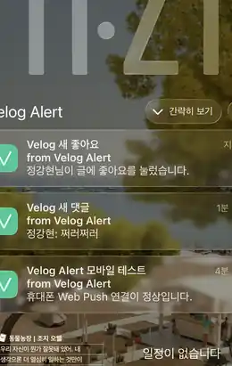
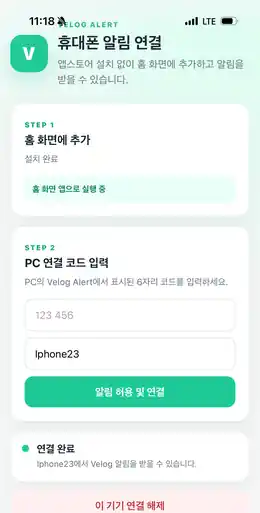

# 🔔 Velog Alert

<p align="center">
  <strong>Velog의 새 활동을 Chrome과 모바일에서 받아보는 Self-hosted Notification Extension</strong>
</p>

<p align="center">
  댓글 · 답글 · 좋아요 · 새 팔로워 · 팔로잉 새 글을 감지하고,<br/>
  PC가 꺼져 있어도 개인 Cloudflare Worker가 약 30초 간격으로 확인해 모바일 PWA로 전달합니다.
</p>

<p align="center">
  
  
  
  
  
</p>

<p align="center">
  Developer · <a href="https://github.com/0JDaEun"><strong>0JDaEun</strong></a>
  &nbsp;·&nbsp;
  <a href="https://github.com/0JDaEun/velog-alert">Repository</a>
</p>

<p align="center">
  📖 <a href="https://velog.io/@dandonedan/Velog-%EC%95%8C%EB%A6%BC-%EC%99%9C-%EC%97%86%EC%A7%80-%EC%A7%81%EC%A0%91-%EB%A7%8C%EB%93%A4%EC%96%B4%EB%B3%B8-Chrome-Extension%EB%B6%80%ED%84%B0-%EB%AA%A8%EB%B0%94%EC%9D%BC-%EC%95%8C%EB%A6%BC%EA%B9%8C%EC%A7%80-%EB%A0%88%ED%8F%AC-%EA%B3%B5%EC%9C%A0"><strong>Velog Alert 개발기 읽기</strong></a>
</p>

> Velog Alert는 Velog 공식 제품이 아닌 독립적인 오픈소스 프로젝트입니다.  
> Velog 공식 Webhook이 아니라 **약 30초 polling 기반의 준실시간 알림**을 제공합니다.

### 바로가기

[기능](#한눈에-보기) · [동작 방식](#동작-방식) · [설치](#설치-및-사용법) · [보안](#보안과-개인정보) · [무료 운영](#free-first) · [FAQ](#faq)

---

## 빠른 시작

Velog Alert는 필요한 기능 범위에 따라 설치 단계가 달라집니다.

| 사용 목적 | 필요한 단계 | Cloudflare |
|---|---|:---:|
| PC Chrome 알림만 사용 | Extension 설치 → Velog 로그인 → 최초 확인 | 불필요 |
| PC + 휴대폰 Push | 위 단계 + Cloudflare 배포 → Relay 연결 → PWA Pairing | 필요 |
| PC가 꺼져 있어도 알림 | 위 단계 + Always-on 활성화 | 필요 |

### 가장 간단한 사용 — PC 알림만

~~~text
Extension 설치
→ Velog 로그인
→ Velog Alert 열기
→ 지금 확인
→ 알림 종류 / 확인 주기 설정
~~~

이 경우 Cloudflare 계정, Node.js, 모바일 설정이 전혀 필요하지 않습니다.

### 전체 기능 — 모바일 + PC OFF

~~~text
Extension 설치
→ Velog 로그인 및 최초 확인
→ 자신의 Cloudflare Free Worker 배포
→ Extension에 Relay URL 저장
→ 휴대폰 PWA 설치
→ 6자리 코드로 Pairing
→ 휴대폰 테스트 Push
→ Always-on 전체 알림 활성화
~~~

Cloudflare Plugin/MCP나 별도 서버 프로그램은 필요하지 않습니다.  
Cloudflare 배포에는 **Wrangler CLI**를 사용합니다.

> 처음 설치할 때와 이후 업데이트할 때 명령이 다릅니다.  
> 최초 설치에서는 <code>npm run setup</code>, 이후 업데이트에서는 <code>npm run validate</code> + <code>npm run deploy</code>를 사용하세요.

---

## 한눈에 보기

<p align="center">
  
  
</p>

<p align="center">
  <sub>Desktop Notification · Mobile Web Push</sub>
</p>

Velog Alert는 **PC에서만 사용하는 Chrome Extension**으로도 동작합니다.  
모바일 알림과 PC OFF Always-on 기능이 필요할 때만 자신의 **Cloudflare Free 계정**에 backend를 배포하면 됩니다.

| 이벤트 | PC 알림 | 모바일 Push | PC OFF |
|---|:---:|:---:|:---:|
| 새 댓글 | ✅ | ✅ | ✅ |
| 새 답글 | ✅ | ✅ | ✅ |
| 좋아요 | ✅ | ✅ | ✅ |
| 새 팔로워 | ✅ | ✅ | ✅ |
| 팔로잉 사용자의 새 글 | ✅ | ✅ | ✅ |

추가로 알림 종류별 ON/OFF, 최근 감지 기록, 테스트 알림, 중복 방지, 최초 설치 baseline, Chrome 재시작 대응을 제공합니다.

---

## 동작 방식

### PC가 켜져 있을 때

```text
Velog
  ↓
Chrome Extension
  ↓ 약 30초
새 활동 감지
  ├─ Chrome Notification
  └─ Mobile Web Push
```

Chrome Extension이 직접 Velog를 확인합니다. 이때 Cloudflare에는 heartbeat를 보내 **불필요한 중복 Cloud polling을 건너뜁니다.**

### PC가 꺼져 있을 때

```text
Velog
  ↓
User's Cloudflare Worker
  ↓
Durable Object Alarm
  ↓ 약 30초
새 활동 감지
  ↓
Web Push
  ↓
Android / iPhone PWA
```

PC의 마지막 heartbeat는 약 90초 동안 유효합니다. 따라서 PC를 막 종료한 직후에는 Cloud 전환까지 약간의 시간이 추가될 수 있고, 이후에는 약 30초 polling으로 동작합니다.

---

## 설치 및 사용법

아래 순서는 **처음 설치하는 사용자 기준**입니다.  
PC 알림만 필요하면 STEP 1~3까지만 진행하면 됩니다.

### 설치 전 준비

#### PC 알림만 사용할 경우

- Chrome 120 이상
- Velog 계정
- Velog 로그인 상태

#### 모바일 / PC OFF까지 사용할 경우

위 항목에 추가로 다음이 필요합니다.

- Git
- Node.js 20 이상
- npm
- Cloudflare Free 계정
- Android Chrome 또는 iPhone Safari

Node.js 버전은 다음처럼 확인할 수 있습니다.

~~~bash
node -v
npm -v
~~~

Node.js 20 미만이면 Cloudflare setup이 중단됩니다.

---

### STEP 1. Chrome Extension 설치

현재 Chrome Web Store 등록 전이므로 **압축 해제 후 직접 로드하는 방식**을 기준으로 합니다.

#### 방법 A. 배포 ZIP으로 설치

1. <code>Velog_Alert_v2.1.0_EXTENSION.zip</code>을 받습니다.
2. ZIP을 원하는 폴더에 압축 해제합니다.
3. Chrome 주소창에 <code>chrome://extensions</code>를 입력합니다.
4. 우측 상단 **개발자 모드**를 켭니다.
5. **압축해제된 확장 프로그램을 로드합니다**를 누릅니다.
6. <code>manifest.json</code>이 바로 들어 있는 폴더를 선택합니다.
7. 목록에 **Velog Alert 2.1.0**이 나타나는지 확인합니다.
8. 필요하면 툴바의 퍼즐 아이콘에서 Velog Alert를 고정합니다.

> ZIP 파일 자체를 선택하는 것이 아닙니다. 반드시 먼저 압축을 풀어야 합니다.

<p align="center">
  
</p>

#### 방법 B. 소스 코드로 설치

~~~bash
git clone https://github.com/0JDaEun/velog-alert.git
cd velog-alert
~~~

v2.1이 아직 <code>main</code>에 병합되기 전 테스트 단계라면:

~~~bash
git checkout feat/cloudflare-free-first-v3
~~~

그 다음 <code>chrome://extensions</code>에서 저장소 루트 폴더를 **압축해제된 확장 프로그램**으로 로드합니다.

#### 정상 설치 확인

Extension Popup을 열었을 때 다음 항목이 보이면 정상입니다.

- 현재 상태
- 지금 확인
- 테스트 알림
- 휴대폰 알림 연결
- 댓글 / 답글 / 좋아요 / 새 팔로워 / 팔로우 새 글
- 확인 주기
- 최근 감지

---

### STEP 2. Velog 로그인과 최초 확인

1. Chrome에서 <code>https://velog.io</code>에 로그인합니다.
2. Velog Alert Popup을 엽니다.
3. **Velog 인증** 상태가 정상인지 확인합니다.
4. **테스트 알림**을 눌러 Chrome 알림 권한이 정상인지 확인합니다.
5. **지금 확인**을 한 번 누릅니다.

최초 실행에서는 현재 알림과 팔로잉 Feed를 **baseline**으로 저장합니다.

따라서 설치 직후 과거 댓글이나 예전 게시물이 한꺼번에 알림으로 표시되지 않는 것이 정상입니다.  
이후 새로 발생한 이벤트부터 신규 알림으로 판단합니다.

#### 로그인이 인식되지 않을 때

먼저 Velog 탭에서 로그인이 유지되는지 확인한 뒤:

~~~text
Velog 새로고침
→ Extension Popup 다시 열기
→ 지금 확인
~~~

순서로 다시 확인합니다.

---

### STEP 3. PC 알림 설정

Popup의 **알림 종류**에서 원하는 항목을 켜거나 끌 수 있습니다.

| 항목 | 의미 | 기본값 |
|---|---|:---:|
| 댓글 | 내 게시글에 새 댓글 | ON |
| 답글 | 댓글에 새 답글 | ON |
| 좋아요 | 게시글 좋아요 | OFF |
| 새 팔로워 | 나를 새로 팔로우한 사용자 | OFF |
| 팔로우 새 글 | 내가 팔로우한 사용자의 새 게시물 | ON |

확인 주기는 다음 중 선택할 수 있습니다.

~~~text
30초
1분
5분
10분
30분
~~~

기본값은 **30초**입니다.

Chrome이 실행 중일 때 Extension이 이 주기에 맞춰 Velog를 확인합니다.

#### 최근 감지

Popup 하단의 **최근 감지**에서 새로 감지된 이벤트를 확인할 수 있습니다.  
**기록 지우기**는 최근 표시 기록을 비우는 기능이며 Velog 원본 데이터에는 영향을 주지 않습니다.

#### 팔로우 새 글의 기준

팔로잉 새 글 알림은 기존에 팔로우하고 있던 사용자의 **새 게시물**을 감지합니다.

새 사용자를 방금 팔로우했을 때 Feed에 과거 게시물이 나타나는 경우에는 과거 글을 새 알림으로 오인하지 않도록 baseline 처리를 합니다.

여기까지 완료하면 **PC Chrome 알림만 사용하는 설치는 끝입니다.**

---

### STEP 4. Cloudflare Self-host backend 최초 배포

모바일 Push 또는 PC OFF Always-on 기능이 필요할 때만 진행합니다.

각 사용자는 자신의 Cloudflare 계정에 Worker를 직접 배포합니다.

~~~text
내 Chrome Extension
        ↓
내 Cloudflare Worker / Durable Objects
        ↓
내 휴대폰 PWA
~~~

개발자 0JDaEun의 중앙 서버에 모든 사용자의 Velog 인증정보를 모으는 구조가 아닙니다.

#### 4-1. 저장소 준비

~~~bash
git clone https://github.com/0JDaEun/velog-alert.git
cd velog-alert

# v2.1 정식 merge 전 테스트 중인 경우
git checkout feat/cloudflare-free-first-v3

cd cloudflare
npm install
~~~

이미 저장소를 받은 상태라면 다시 clone할 필요가 없습니다.

#### 4-2. Cloudflare 로그인

~~~bash
npx wrangler login --device --use-keyring
~~~

브라우저가 열리면 본인의 Cloudflare 계정으로 로그인하고 권한을 승인합니다.

로그인 여부는 다음 명령으로 확인할 수 있습니다.

~~~bash
npx wrangler whoami
~~~

계정 정보가 출력되면 정상입니다.

#### 4-3. 최초 setup

~~~bash
npm run setup
~~~

setup은 다음 작업을 자동으로 수행합니다.

~~~text
Node.js 20+ 확인
→ Cloudflare 로그인 확인
→ Free-only 구조 검사
→ VAPID 연락 이메일 입력
→ AES-256-GCM AUTH_KEY 생성
→ Web Push VAPID key pair 생성
→ 임시 Secret 파일 생성
→ Wrangler dry-run
→ Worker + Durable Objects + PWA 배포
→ 임시 Secret 파일 삭제
~~~

중간에 다음 입력을 요구합니다.

~~~text
VAPID 연락 이메일:
~~~

본인이 사용할 이메일 주소를 입력합니다.

이 이메일은 Web Push VAPID subject에 사용됩니다.

#### 4-4. 배포 URL 확인

성공하면 Wrangler 출력 마지막 부분에 다음 형태의 URL이 나타납니다.

~~~text
https://<worker-name>.<your-subdomain>.workers.dev
~~~

예를 들어:

~~~text
https://velog-alert-mobile.example.workers.dev
~~~

이 주소가 **본인의 Relay URL이자 모바일 PWA 주소**입니다.

> <code>https://*.workers.dev</code>를 그대로 입력하면 안 됩니다.  
> 별표는 패턴 설명용이며, Wrangler가 실제로 출력한 본인의 주소를 사용해야 합니다.

#### 4-5. Health 확인

브라우저에서 다음 주소를 열어볼 수 있습니다.

~~~text
https://내-worker.workers.dev/api/health
~~~

정상 배포라면 대략 다음 형태의 응답을 반환합니다.

~~~json
{
  "ok": true,
  "service": "velog-alert",
  "version": "2.1.0",
  "backend": "cloudflare-self-host",
  "pollIntervalSeconds": 30
}
~~~

---

### STEP 5. Extension에 Relay URL 연결

Chrome Extension Popup에서 **휴대폰 알림 연결**을 누릅니다.

설정 화면 하단의 **Cloudflare Relay 설정**에서:

~~~text
Relay URL
→ Wrangler가 출력한 workers.dev 주소 입력
→ 저장 및 연결 확인
~~~

을 진행합니다.

<p align="center">
  
</p>

정상이라면 다음과 비슷한 문구가 표시됩니다.

~~~text
연결 정상 · cloudflare-self-host · 30초 Cloud polling
~~~

연결 확인이 실패하면 URL은 저장되지 않습니다.

#### Relay URL을 변경한 경우

Relay URL은 PWA의 origin과 연결됩니다.

따라서 Worker 주소를 바꾸면 기존 휴대폰 연결을 그대로 사용할 수 없으며 **새 Relay 주소에서 PWA를 다시 연결**해야 합니다.

---

### STEP 6. 휴대폰 PWA 설치 및 Pairing

PC의 **휴대폰 알림** 설정에서 먼저:

~~~text
휴대폰 알림 사용 → ON
→ 6자리 연결 코드 만들기
~~~

를 진행합니다.

연결 코드는:

- 6자리 숫자
- 약 10분 동안 유효
- 한 번만 사용 가능
- 연결 성공 후 폐기

됩니다.

<p align="center">
  
</p>

#### Android · Chrome

1. Android Chrome에서 자신의 <code>workers.dev</code> Relay URL을 엽니다.
2. Chrome 메뉴 **⋮**를 누릅니다.
3. **앱 설치** 또는 **홈 화면에 추가**를 선택합니다.
4. 홈 화면에 생긴 **Velog Alert**를 실행합니다.
5. PC Extension에 표시된 6자리 코드를 입력합니다.
6. 기기 이름을 입력합니다. 예: <code>Galaxy S26</code>
7. **알림 허용 및 연결**을 누릅니다.
8. 브라우저의 알림 권한 요청을 허용합니다.
9. PWA에 **연결 완료**가 표시되는지 확인합니다.

#### iPhone · Safari

1. iPhone Safari에서 자신의 <code>workers.dev</code> Relay URL을 엽니다.
2. Safari의 **공유** 버튼을 누릅니다.
3. **홈 화면에 추가**를 선택합니다.
4. **추가**를 눌러 홈 화면에 Velog Alert를 설치합니다.
5. Safari 탭이 아니라 **홈 화면의 Velog Alert 아이콘**으로 앱을 실행합니다.
6. PC Extension의 6자리 코드를 입력합니다.
7. 기기 이름을 입력합니다. 예: <code>내 iPhone</code>
8. **알림 허용 및 연결**을 누릅니다.
9. iOS 알림 권한을 허용합니다.
10. **연결 완료** 상태를 확인합니다.

> iPhone Web Push는 일반 Safari 탭이 아니라 **홈 화면에 추가한 PWA**에서 사용하는 흐름을 기준으로 합니다.

<p align="center">
  
</p>

#### iPhone에서 예전 아이콘이 보이는 경우

iOS는 홈 화면 Web App 아이콘을 강하게 캐시할 수 있습니다.

업데이트 후에도 이전 아이콘이 보인다면:

~~~text
기존 Velog Alert 홈 화면 아이콘 삭제
→ Safari에서 Relay URL 다시 열기
→ 공유
→ 홈 화면에 추가
~~~

순서로 다시 설치하세요.

현재 PWA는 iOS용 180px 아이콘과 192/512px PWA 아이콘을 별도 versioned asset으로 사용합니다.

---

### STEP 7. 휴대폰 테스트 Push

Pairing이 끝나면 PC 설정 화면의 **연결된 기기**에서 **새로고침**을 누릅니다.

연결된 기기가 표시되면:

~~~text
휴대폰 테스트 알림 보내기
~~~

를 누릅니다.

휴대폰에서 다음과 같은 테스트 알림이 오면 Push 연결이 정상입니다.

~~~text
Velog Alert 모바일 테스트
휴대폰 Web Push 연결이 정상입니다.
~~~

테스트 알림이 오지 않는다면 Always-on을 먼저 켜지 말고 Pairing / 알림 권한 / Relay 연결부터 확인하는 것을 권장합니다.

---

### STEP 8. PC OFF Always-on 활성화

휴대폰 테스트 Push까지 정상인 것을 확인한 후 진행합니다.

Extension의 휴대폰 설정에서:

~~~text
PC가 꺼져 있어도 모든 알림 받기
→ Always-on 전체 알림 활성화
~~~

를 누릅니다.

확인 창에는 현재 Velog <code>access_token</code> / <code>refresh_token</code>을 자신의 Cloudflare Worker로 전송해 암호화 저장한다는 내용이 표시됩니다.

사용자가 확인한 경우에만 전송합니다.

Velog 비밀번호는 전송하거나 저장하지 않습니다.

#### 정상 상태

성공하면 다음과 비슷하게 표시됩니다.

~~~text
Always-on 활성화됨
<Velog username>
마지막 Cloud 확인 ...
~~~

#### PC ON / OFF 전환 방식

~~~text
PC ON
→ Chrome Extension이 약 30초 주기로 확인
→ Cloudflare로 heartbeat 전송
→ Cloud polling은 건너뜀

PC OFF
→ 마지막 heartbeat 만료
→ Cloudflare Durable Object가 polling 시작
→ 약 30초 주기로 Velog 확인
→ 새 이벤트가 있으면 Web Push
~~~

Desktop heartbeat는 약 90초 동안 유효합니다.

따라서 PC를 끈 직후에는 Cloud가 즉시 polling을 시작하는 것이 아니라 **최대 약 90초의 전환 시간 + 이후 polling 주기**가 추가될 수 있습니다.

---

### STEP 9. 실제 사용법

설치 이후 일상적으로는 대부분 Chrome Popup만 사용하면 됩니다.

#### 알림 전체 켜기 / 끄기

Popup 상단 스위치로 Extension 자동 확인을 켜거나 끌 수 있습니다.

#### 바로 확인하기

**지금 확인**을 누르면 다음 자동 주기를 기다리지 않고 즉시 Velog를 확인합니다.

#### Desktop 알림 테스트

**테스트 알림**은 Chrome Notification 자체가 정상적으로 표시되는지 확인할 때 사용합니다.

#### 모바일 알림 관리

**휴대폰 알림 연결**에서 다음을 관리할 수 있습니다.

- 휴대폰 알림 사용 ON/OFF
- Relay URL
- 6자리 Pairing code
- 연결된 기기
- 테스트 Push
- Always-on 활성화 / 해제
- Velog 인증 갱신

#### Always-on 인증이 만료된 경우

설정 화면에:

~~~text
Velog 인증 갱신 필요
~~~

가 나타나면:

~~~text
PC에서 Velog 로그인 확인
→ 휴대폰 알림 설정
→ Velog 인증 다시 연결
~~~

순서로 갱신합니다.

---

### STEP 10. 업데이트 방법

#### Extension 코드 업데이트

소스로 설치한 경우:

~~~bash
git pull
~~~

그 다음 <code>chrome://extensions</code>에서 Velog Alert의 **새로고침** 버튼을 누릅니다.

ZIP으로 설치했다면 새 ZIP을 받은 뒤 기존 압축 폴더를 교체하거나 새 폴더로 압축 해제한 후 Extension을 다시 로드합니다.

#### Cloudflare backend 업데이트

**최초 설치 이후에는 일반적인 코드 업데이트 때문에 <code>npm run setup</code>을 다시 실행하지 마세요.**

setup은 새로운 AUTH_KEY와 VAPID key를 생성하는 초기 설치용 명령입니다.

일반 업데이트는:

~~~bash
git pull
cd cloudflare
npm install
npm run validate
npm run deploy
~~~

순서로 진행합니다.

<code>npm run validate</code>는:

~~~text
Free-only 검사
→ TypeScript / setup script 검사
→ Wrangler dry-run
~~~

을 수행합니다.

<code>npm run deploy</code>는 기존 Cloudflare Secret을 유지한 상태에서 새 코드를 배포합니다.

> AUTH_KEY 또는 VAPID key를 의도적으로 회전하려는 경우가 아니라면 setup 재실행보다 일반 deploy를 사용하세요.

---

### STEP 11. 제거 / 초기화

#### Always-on 인증정보만 삭제

~~~text
Extension
→ 휴대폰 알림 연결
→ Always-on 해제 및 인증 삭제
~~~

Cloud에 저장된 Velog 인증정보와 개인 알림 기준점을 삭제합니다.

#### 휴대폰 연결 해제

휴대폰 PWA에서:

~~~text
이 기기 연결 해제
~~~

를 실행합니다.

#### Chrome Extension 제거

<code>chrome://extensions</code>에서 Velog Alert의 **삭제**를 누릅니다.

#### Cloudflare backend 전체 제거

Cloudflare Dashboard에서 본인이 만든 Velog Alert Worker를 삭제합니다.

Cloud backend까지 완전히 제거하려는 경우에는 먼저 Extension에서 **Always-on 해제 및 인증 삭제**를 실행한 뒤 Worker를 제거하는 흐름을 권장합니다.

---

### 설치 문제 빠른 확인

| 증상 | 확인할 것 |
|---|---|
| Velog 로그인 인식 실패 | Velog 로그인 상태 확인 → 페이지 새로고침 → 지금 확인 |
| Chrome 알림이 안 옴 | 테스트 알림 실행 → OS/Chrome 알림 권한 확인 |
| <code>RELAY_URL_REQUIRED</code> | 자신의 <code>workers.dev</code> Relay URL 저장 |
| Relay 연결 확인 실패 | URL 오타 / Worker 배포 여부 / <code>/api/health</code> 확인 |
| Wrangler 로그인이 필요하다고 나옴 | <code>npx wrangler whoami</code> → 필요 시 다시 login |
| 6자리 코드가 안 됨 | 10분 만료 여부 확인 → 새 코드 생성 |
| iPhone Push가 안 옴 | Safari 탭이 아니라 홈 화면 PWA에서 연결했는지 확인 |
| iPhone 아이콘이 예전 버전 | 기존 홈 화면 앱 삭제 후 Safari에서 다시 추가 |
| PC OFF 직후 알림이 늦음 | 약 90초 heartbeat TTL 이후 Cloud polling 전환 |
| Always-on 인증 만료 | PC Velog 로그인 후 **Velog 인증 다시 연결** |
| 설치 직후 과거 알림이 안 옴 | 정상 동작 — 최초 baseline 이후 신규 이벤트부터 알림 |

자세한 설치 문서는 [docs/INSTALLATION.md](docs/INSTALLATION.md), Cloudflare 배포 상세는 [docs/CLOUDFLARE_SELF_HOST.md](docs/CLOUDFLARE_SELF_HOST.md)를 참고하세요.

---

## 알림 설정

추천 기본값:

| 설정 | 권장 |
|---|:---:|
| 전체 알림 | ON |
| 댓글 | ON |
| 답글 | ON |
| 팔로우 새 글 | ON |
| 좋아요 | 선택 |
| 새 팔로워 | 선택 |
| 확인 주기 | 30초 |

팔로잉 새 글은 **기존에 팔로우하고 있던 사용자의 새 게시물**을 대상으로 합니다. 새 사용자를 막 팔로우했을 때 Feed에 과거 게시물이 추가되는 경우는 신규 알림에서 제외하도록 처리합니다.

---

## 보안과 개인정보

Self-host 구조의 핵심은 **사용자의 인증정보를 0JDaEun의 중앙 서버에 모으지 않는 것**입니다.

| 항목 | 처리 방식 |
|---|---|
| Velog 비밀번호 | 수집하지 않음 |
| Desktop access token | 요청 시점에만 사용, Chrome storage에 복사하지 않음 |
| Always-on token | 사용자가 명시적으로 활성화할 때만 자신의 Worker로 전송 |
| Cloud 저장 | AES-256-GCM 암호화 |
| 암호화 master key | Cloudflare Secret |
| Push subscription | 자신의 Cloudflare backend에 저장 |
| 중앙 0JDaEun backend | 기본 배포 구조에서 사용하지 않음 |
| Analytics / 광고 SDK | 사용하지 않음 |

신뢰할 수 없는 제3자의 Relay URL을 입력하지 마세요. Always-on을 사용할 때 Relay 운영자는 해당 backend의 실행 환경을 관리할 수 있으므로 **자신의 Cloudflare Worker 사용을 권장**합니다.

자세한 내용은 [PRIVACY.md](PRIVACY.md)와 [SECURITY.md](SECURITY.md)를 참고하세요.

---

## Free-first

Velog Alert v2.1은 **기본 개발·Self-host 흐름을 유료 인프라 없이 사용할 수 있도록 설계**했습니다.

```text
GitHub public repository
Chrome Extension
Cloudflare Workers Free
SQLite-backed Durable Objects Free
Workers Static Assets
GitHub Actions standard public runners
```

프로젝트 코드에는 **자동으로 Paid plan으로 전환하는 기능이 없습니다.**

다만 무료 플랜은 무제한이 아니며 Cloudflare의 현재 Free quota와 정책이 적용됩니다. 한도를 초과하면 기능이 일시적으로 실패할 수 있습니다. 실제 운영 전에는 자신의 Cloudflare Usage를 확인하세요.

프로젝트의 무료 운영 원칙은 [FREE_ONLY_POLICY.md](docs/FREE_ONLY_POLICY.md)에 정리되어 있습니다.

---

## FAQ

<details>
<summary><strong>Q. PC 알림만 쓰고 싶은데 Cloudflare가 꼭 필요한가요?</strong></summary>

아니요. Chrome Extension만 설치하고 Velog에 로그인하면 PC 알림 기능을 사용할 수 있습니다. Cloudflare는 모바일 Push 또는 PC OFF Always-on을 사용할 때만 필요합니다.

</details>

<details>
<summary><strong>Q. https://*.workers.dev 를 그대로 Relay URL에 넣으면 되나요?</strong></summary>

아니요. 별표는 URL 패턴을 설명하기 위한 표기입니다. <code>npm run setup</code> 마지막에 Wrangler가 출력한 본인의 실제 <code>https://...workers.dev</code> 주소를 입력하세요.

</details>

<details>
<summary><strong>Q. setup은 업데이트할 때마다 실행하나요?</strong></summary>

아니요. <strong>setup은 최초 설치용</strong>입니다.

일반적인 코드 업데이트는:

~~~bash
git pull
cd cloudflare
npm install
npm run validate
npm run deploy
~~~

를 사용하세요.

setup은 AUTH_KEY와 VAPID key를 새로 생성하므로 단순 업데이트 목적으로 반복 실행하지 않는 것이 좋습니다.

</details>

<details>
<summary><strong>Q. Wrangler 로그인은 성공했는데 setup에서 로그인이 필요하다고 나옵니다.</strong></summary>

먼저 다음 명령으로 현재 로그인 상태를 확인하세요.

~~~bash
npx wrangler whoami
~~~

로그인이 안 되어 있다면:

~~~bash
npx wrangler login --device --use-keyring
~~~

후 다시 <code>npm run setup</code>을 실행하세요.

Windows / Git Bash에서도 프로젝트에 설치된 로컬 Wrangler를 사용하도록 setup script가 구성되어 있습니다.

</details>

<details>
<summary><strong>Q. iPhone에서 홈 화면 아이콘이 예전 버전으로 보입니다.</strong></summary>

iOS가 기존 Web App 아이콘을 캐시하고 있을 수 있습니다.

~~~text
기존 Velog Alert 홈 화면 아이콘 삭제
→ Safari에서 workers.dev 주소 다시 열기
→ 공유
→ 홈 화면에 추가
~~~

순서로 다시 설치하세요.

</details>

<details>
<summary><strong>Q. iPhone에서 Push가 오지 않습니다.</strong></summary>

다음을 확인하세요.

1. Safari에서 Relay URL을 열었는지
2. **홈 화면에 추가**했는지
3. Safari 탭이 아니라 홈 화면의 Velog Alert를 실행했는지
4. 6자리 Pairing을 완료했는지
5. iOS 알림 권한을 허용했는지
6. PC에서 **휴대폰 테스트 알림 보내기**가 성공하는지

</details>

<details>
<summary><strong>Q. PC를 끄면 바로 30초 안에 모바일 알림으로 전환되나요?</strong></summary>

항상 그런 것은 아닙니다. 마지막 Desktop heartbeat가 약 90초 동안 유효합니다.

따라서 PC 종료 직후에는 heartbeat 만료 시간이 먼저 지나고, 그 다음 Cloud polling이 동작합니다. 전환 이후 polling 목표 주기는 약 30초입니다.

</details>

<details>
<summary><strong>Q. 완전한 실시간 알림인가요?</strong></summary>

아닙니다. Velog Alert 전용 공식 Webhook이 아니라 주기 조회 방식이므로 정확한 표현은 **약 30초 polling 기반 준실시간 알림**입니다.

</details>

<details>
<summary><strong>Q. Cloudflare 유료 플랜이 필요한가요?</strong></summary>

기본 Self-host 구성은 Workers Free를 전제로 설계했습니다. 프로젝트가 자동으로 유료 플랜을 활성화하지 않습니다.

다만 무료 플랜에는 Cloudflare의 현재 quota와 정책이 적용되므로 자신의 계정 Usage는 직접 확인해야 합니다.

</details>

<details>
<summary><strong>Q. npm install에서 npm warn allow-scripts가 나옵니다.</strong></summary>

<code>esbuild</code> 또는 <code>workerd</code> install script 관련 경고 자체가 반드시 설치 실패를 의미하지는 않습니다.

먼저:

~~~bash
npx wrangler whoami
npm run validate
~~~

가 정상 동작하는지 확인하세요.

실제 실행 파일 관련 오류가 발생한 경우에만 <code>npm approve-scripts --allow-scripts-pending</code>으로 필요한 package를 확인한 뒤 승인하세요.

</details>

---

## 개발 구조

```text
.
├─ manifest.json
├─ src/
│  ├─ api/
│  ├─ background/
│  ├─ bridge/
│  ├─ core/
│  ├─ mobile/
│  ├─ popup/
│  └─ storage/
├─ cloudflare/
│  ├─ public/          # PWA
│  ├─ scripts/
│  ├─ src/
│  │  ├─ index.ts
│  │  ├─ registry.ts
│  │  ├─ shard.ts
│  │  ├─ velog.ts
│  │  ├─ crypto.ts
│  │  └─ push.ts
│  └─ wrangler.jsonc
├─ docs/
└─ tests/
```

주요 구성:

- **Chrome MV3 Service Worker** — Desktop polling / Chrome notification
- **RegistryDO** — 6자리 pairing과 account-to-shard 배정
- **PollShardDO** — PC OFF polling / 인증 상태 / dedup
- **Workers Static Assets** — 모바일 PWA
- **Web Push + VAPID** — Android / iPhone 알림
- **AES-GCM auth vault** — Always-on Velog 인증정보 암호화

---

## 테스트

Extension:

```bash
npm install
npm run check
npm test
```

Cloudflare:

```bash
cd cloudflare
npm install
npm run free-check
npm run check
npm run dry-run
```

`dry-run`은 실제 Worker를 배포하지 않고 bundle과 Wrangler 설정을 검사합니다.

---

## 문서

| 문서 | 내용 |
|---|---|
| [설치 상세](docs/INSTALLATION.md) | Extension, PWA, Always-on 설치 순서 |
| [Cloudflare Self-host](docs/CLOUDFLARE_SELF_HOST.md) | Wrangler CLI 배포와 Relay 설정 |
| [Free-only Policy](docs/FREE_ONLY_POLICY.md) | 개발/운영 비용 $0 기본 원칙 |
| [Privacy](PRIVACY.md) | 저장·처리되는 데이터 |
| [Security](SECURITY.md) | token, Secret, Relay 보안 모델 |

---

## Developer

**0JDaEun**

- GitHub: https://github.com/0JDaEun
- Repository: https://github.com/0JDaEun/velog-alert
- 설치 상세: [docs/INSTALLATION.md](docs/INSTALLATION.md)
- Cloudflare Self-host: [docs/CLOUDFLARE_SELF_HOST.md](docs/CLOUDFLARE_SELF_HOST.md)

---

Velog Alert는 Velog 사용 중 놓치기 쉬운 활동을 더 빠르게 확인하기 위해 만든 개인 프로젝트입니다.
