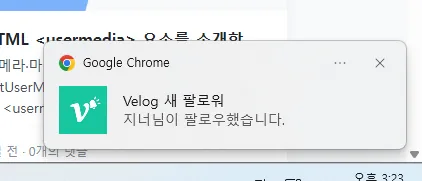

<p align="center">
  
</p>

<h1 align="center">Velog Alert</h1>

<p align="center">
  <strong>Velog의 새 활동을 Chrome과 모바일에서 받아보는 Self-hosted Notification Extension</strong>
</p>

<p align="center">
  댓글 · 답글 · 좋아요 · 새 팔로워 · 팔로잉 새 글을 감지하고,<br/>
  PC가 꺼져 있어도 개인 Cloudflare Worker가 약 30초 간격으로 확인해 모바일 PWA로 전달합니다.
</p>

<p align="center">
  
  
  
  
  
</p>

<p align="center">
  Developer · <a href="https://github.com/0JDaEun"><strong>0JDaEun</strong></a>
  &nbsp;·&nbsp;
  <a href="https://github.com/0JDaEun/velog-alert">Repository</a>
  &nbsp;·&nbsp;
  <a href="https://velog.io/@dandonedan/Velog-%EC%95%8C%EB%A6%BC-%EC%99%9C-%EC%97%86%EC%A7%80-%EC%A7%81%EC%A0%91-%EB%A7%8C%EB%93%A4%EC%96%B4%EB%B3%B8-Chrome-Extension%EB%B6%80%ED%84%B0-%EB%AA%A8%EB%B0%94%EC%9D%BC-%EC%95%8C%EB%A6%BC%EA%B9%8C%EC%A7%80-%EB%A0%88%ED%8F%AC-%EA%B3%B5%EC%9C%A0"><strong>Velog 개발기</strong></a>
</p>

> [!NOTE]
> Velog Alert는 Velog 공식 제품이 아닌 독립적인 오픈소스 프로젝트입니다.  
> 공식 Webhook이 아니라 **약 30초 polling 기반의 준실시간 알림**을 제공합니다.

---

## 먼저: 어떤 설치가 필요한가요?

| 원하는 기능 | 설치 범위 |
|---|---|
| **PC에서만 알림 받기** | Chrome Extension만 설치 |
| **PC + 휴대폰에서 알림 받기** | Extension + Cloudflare Relay + PWA |
| **PC를 꺼도 휴대폰 알림 받기** | 위 구성 + Always-on 활성화 |

### PC 알림만 필요하다면

아래 **A. Chrome Extension 설치**까지만 진행하면 됩니다.

### 모바일 / PC OFF 알림까지 필요하다면

아래 순서대로 진행합니다.

```text
A. Chrome Extension 설치
        ↓
B. Cloudflare Relay 배포
        ↓
C. Relay URL 연결
        ↓
D. 휴대폰 PWA Pairing
        ↓
E. 테스트 Push
        ↓
F. Always-on 활성화
```

> [!TIP]
> 처음 설치한다면 [전체 설치 가이드](docs/INSTALLATION.md)를 그대로 따라가는 것이 가장 빠릅니다.

---

## 한눈에 보기

| 이벤트 | PC 알림 | 모바일 Push | PC OFF |
|---|:---:|:---:|:---:|
| 새 댓글 | ✅ | ✅ | ✅ |
| 새 답글 | ✅ | ✅ | ✅ |
| 좋아요 | ✅ | ✅ | ✅ |
| 새 팔로워 | ✅ | ✅ | ✅ |
| 팔로잉 사용자의 새 글 | ✅ | ✅ | ✅ |

기본 확인 주기는 **30초**이며 30초 / 1분 / 5분 / 10분 / 30분 중에서 선택할 수 있습니다.

---

## 실제 동작 화면

### Desktop — Chrome Notification

<p align="center">
  
</p>

<p align="center">
  <sub>새 팔로워 감지 → Windows Chrome Notification</sub>
</p>

### Mobile — iPhone Web Push

<p align="center">
  
</p>

<p align="center">
  <sub>PC OFF 상태에서도 Cloudflare → Web Push로 전달되는 실제 iPhone 알림</sub>
</p>

> [!NOTE]
> 위 화면은 현재 v2.1 최신 로고가 적용된 실제 알림 화면입니다.

---

# 설치 빠른 시작

## A. Chrome Extension 설치

### 권장: GitHub 소스 ZIP 사용

1. Repository 상단 **Code → Download ZIP**을 누릅니다.
2. 내려받은 `velog-alert-main.zip`을 압축 해제합니다.
3. 압축을 풀면 다음처럼 **`manifest.json`이 바로 보이는 폴더**가 생깁니다.

```text
velog-alert-main/
├─ manifest.json     ← Chrome이 확인하는 파일
├─ assets/
├─ src/
├─ cloudflare/
├─ docs/
└─ ...
```

4. Chrome 주소창에 `chrome://extensions`를 입력합니다.
5. 우측 상단 **개발자 모드**를 켭니다.
6. **압축해제된 확장 프로그램을 로드합니다**를 누릅니다.
7. **`manifest.json`이 바로 들어 있는 `velog-alert-main/` 폴더**를 선택합니다.

> [!IMPORTANT]
> ZIP 파일 자체를 선택하는 것이 아닙니다.  
> **압축을 푼 뒤 `manifest.json`이 바로 들어 있는 폴더를 선택합니다.**

### Git으로 받는 경우

```bash
git clone https://github.com/0JDaEun/velog-alert.git
cd velog-alert
```

이 경우 Chrome에서 선택할 폴더는 **저장소 루트 `velog-alert/`** 입니다.

### 설치 후 첫 실행

```text
Velog 로그인
→ Velog Alert Popup 열기
→ 테스트 알림
→ 지금 확인
```

최초 확인은 현재 상태를 baseline으로 저장합니다.  
따라서 설치 이전의 과거 알림이 한꺼번에 뜨지 않는 것이 정상입니다.

> PC 알림만 사용할 경우 여기까지 진행하면 됩니다.

---

## B. Cloudflare Relay 배포

모바일 Push 또는 PC OFF Always-on이 필요할 때만 진행합니다.

### 준비물

- Node.js 20 이상
- npm
- Git
- Cloudflare Free 계정

### 실행 위치

Cloudflare 명령은 **반드시 `velog-alert/cloudflare/` 폴더에서 실행**합니다.

```bash
git clone https://github.com/0JDaEun/velog-alert.git
cd velog-alert
cd cloudflare

npm install
npx wrangler login --device --use-keyring
npm run setup
```

현재 위치는 다음이어야 합니다.

```text
velog-alert/cloudflare/
├─ package.json
├─ wrangler.jsonc
├─ scripts/
├─ src/
└─ public/
```

`npm run setup`은 최초 설치에 필요한 AUTH_KEY / VAPID Key 생성, Secret 등록, dry-run, Worker·Durable Objects·PWA 배포를 자동으로 처리합니다.

배포가 끝나면 Wrangler가 다음 형태의 URL을 출력합니다.

```text
https://<worker-name>.<your-subdomain>.workers.dev
```

이 문서에서는 이 주소를 **Cloudflare Relay URL**이라고 부릅니다.

> 같은 URL이 Worker API 주소이자 모바일 PWA 주소로 사용됩니다.

자세한 내용: [Cloudflare Self-host 가이드](docs/CLOUDFLARE_SELF_HOST.md)

---

## C. Relay URL 연결

Chrome Extension에서:

```text
Velog Alert
→ 휴대폰 알림 연결
→ Cloudflare Relay 설정
→ Relay URL 입력
→ 저장 및 연결 확인
```

정상이라면 다음과 비슷하게 표시됩니다.

```text
연결 정상 · cloudflare-self-host · 30초 Cloud polling
```

---

## D. 휴대폰 PWA Pairing

PC에서 **6자리 연결 코드 만들기**를 누릅니다.

연결 코드는:

- 6자리
- 약 10분 유효
- 1회 사용
- 연결 성공 후 폐기

### Android

```text
Android Chrome에서 Relay URL 열기
→ 앱 설치 / 홈 화면에 추가
→ Velog Alert 실행
→ 6자리 코드 입력
→ 알림 허용 및 연결
```

### iPhone

```text
Safari에서 Relay URL 열기
→ 공유
→ 홈 화면에 추가
→ 홈 화면의 Velog Alert 실행
→ 6자리 코드 입력
→ 알림 허용 및 연결
```

> [!IMPORTANT]
> iPhone Web Push는 **Safari 탭이 아니라 홈 화면에 추가한 PWA**에서 연결하는 흐름을 기준으로 합니다.

---

## E. 테스트 Push

PC의 휴대폰 알림 설정에서:

```text
연결된 기기
→ 새로고침
→ 휴대폰 테스트 알림 보내기
```

휴대폰에 아래 알림이 오면 연결 완료입니다.

```text
Velog Alert 모바일 테스트
휴대폰 Web Push 연결이 정상입니다.
```

---

## F. PC OFF Always-on

테스트 Push까지 확인한 다음:

```text
PC가 꺼져 있어도 모든 알림 받기
→ Always-on 전체 알림 활성화
```

사용자가 직접 활성화한 경우에만 현재 Velog access / refresh token을 **자신의 Cloudflare Worker**로 전달합니다.

- Velog 비밀번호는 사용하지 않습니다.
- Token은 AES-256-GCM으로 암호화해 저장합니다.
- 암호화 key는 Cloudflare Secret으로 관리합니다.

정상 상태:

```text
Always-on 활성화됨
<Velog username>
마지막 Cloud 확인 ...
```

---

# 동작 방식

## PC가 켜져 있을 때

```text
Velog
  ↓
Chrome Extension
  ↓ 약 30초
새 활동 감지
  ├─ Chrome Notification
  └─ Mobile Web Push
```

Extension이 Cloudflare에 heartbeat를 보내므로 Cloud 쪽 중복 polling을 건너뜁니다.

## PC가 꺼져 있을 때

```text
Velog
  ↓
Cloudflare Worker
  ↓
Durable Object Alarm
  ↓ 약 30초
새 활동 감지
  ↓
Web Push
  ↓
Android / iPhone PWA
```

마지막 Desktop heartbeat는 약 90초 동안 유효합니다.  
PC 종료 직후에는 이 TTL이 만료된 뒤 Cloud polling으로 전환됩니다.

---

# 최초 설치와 업데이트는 다릅니다

## 최초 Cloudflare 설치

위치: **`velog-alert/cloudflare/`**

```bash
npm install
npx wrangler login --device --use-keyring
npm run setup
```

## 이후 일반 업데이트

```bash
cd velog-alert
git pull

cd cloudflare
npm install
npm run validate
npm run deploy
```

> [!WARNING]
> 일반적인 코드 업데이트 때문에 `npm run setup`을 다시 실행하지 마세요.  
> `setup`은 AUTH_KEY와 VAPID Key를 새로 생성하는 **최초 설치용 명령**입니다.

---

# 문서

| 문서 | 언제 보면 되나요? |
|---|---|
| **[INSTALLATION.md](docs/INSTALLATION.md)** | 처음 설치할 때 — Extension부터 PWA/Always-on까지 전체 순서 |
| **[CLOUDFLARE_SELF_HOST.md](docs/CLOUDFLARE_SELF_HOST.md)** | Cloudflare 최초 배포·업데이트·삭제가 필요할 때 |
| **[TROUBLESHOOTING.md](docs/TROUBLESHOOTING.md)** | 로그인, Relay, Push, PWA, Always-on이 정상 동작하지 않을 때 |
| [FREE_ONLY_POLICY.md](docs/FREE_ONLY_POLICY.md) | Free-first 운영 원칙 |
| [PRIVACY.md](PRIVACY.md) | 저장·처리되는 데이터 |
| [SECURITY.md](SECURITY.md) | Token / Secret / Relay 보안 모델 |

---

# 기본 알림 설정

| 설정 | 기본값 |
|---|:---:|
| 전체 알림 | ON |
| 댓글 | ON |
| 답글 | ON |
| 좋아요 | OFF |
| 새 팔로워 | OFF |
| 팔로우 새 글 | ON |
| 확인 주기 | 30초 |

---

# 보안과 개인정보

Self-host 구조에서는 사용자의 Velog 인증정보를 개발자 0JDaEun의 중앙 서버에 모으지 않습니다.

| 항목 | 처리 |
|---|---|
| Velog 비밀번호 | 수집하지 않음 |
| Desktop access token | 요청 시점에 사용 |
| Always-on token | 명시적으로 활성화했을 때만 자신의 Worker로 전송 |
| Cloud 저장 | AES-256-GCM 암호화 |
| 암호화 key | Cloudflare Secret |
| Push subscription | 자신의 Cloudflare backend에 저장 |
| 중앙 0JDaEun backend | 기본 구조에서 사용하지 않음 |

신뢰할 수 없는 제3자의 Relay URL 대신 **자신의 Cloudflare Worker** 사용을 권장합니다.

---

# 개발 / 테스트

Extension:

```bash
npm install
npm run check
npm test
```

Cloudflare:

```bash
cd cloudflare
npm install
npm run validate
```

CI는 테스트가 통과하면 테스트용 Extension package도 생성합니다.

```text
Velog_Alert_v2.1.0_EXTENSION.zip
```

> 이 파일은 CI artifact 이름과 패키징 구조를 고정하기 위한 테스트 산출물입니다.  
> 일반 설치는 위의 **GitHub 소스 ZIP / Git clone 방식**을 기준으로 안내합니다.

---

# 프로젝트 구조

```text
velog-alert/
├─ manifest.json          # Chrome Extension manifest
├─ assets/                # Extension icons
├─ src/                   # Extension source
├─ cloudflare/
│  ├─ package.json        # setup / validate / deploy scripts
│  ├─ wrangler.jsonc
│  ├─ scripts/
│  ├─ src/
│  └─ public/             # Mobile PWA
├─ docs/
├─ tests/
└─ README.md
```

---

## 문제 해결

설치 중 막혔다면 먼저 [Troubleshooting](docs/TROUBLESHOOTING.md)을 확인하세요.

특히 자주 확인할 항목:

- Velog 로그인이 인식되지 않음
- Relay URL 연결 실패
- 6자리 Pairing 실패
- iPhone Push가 오지 않음
- PC OFF 알림 전환이 늦음
- Always-on 인증 갱신 필요

---

<p align="center">
  <strong>Velog Alert v2.1.0</strong><br/>
  Developer · <a href="https://github.com/0JDaEun">0JDaEun</a>
</p>
